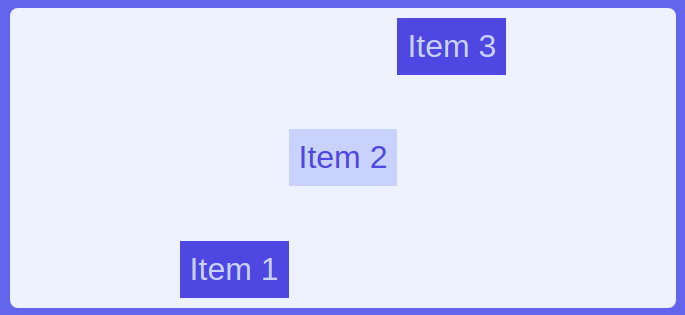

# Exercise E

Difficulty: ⭐

In this exercise you'll learn about:

- The cross axis and how items stretch along the cross axis by default.
- The `align-items` property to position items along the cross axis
- The `align-self` property, to align specific flex children along the cross axis independently

Result:

