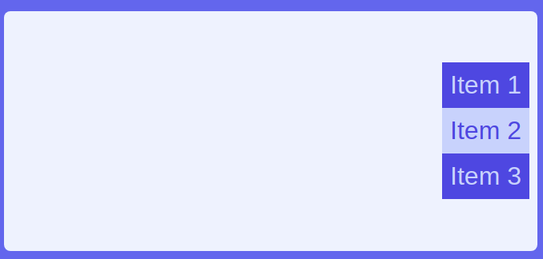

# Exercise F

Difficulty: ⭐

In this exercise you'll learn about:

- Arranging the flex children as a column instead of a row.
- The direction of main axis and cross axis depending on whether the flexbox is row or column.
- Arranging the position of flex children for column flexboxes.

Result:

