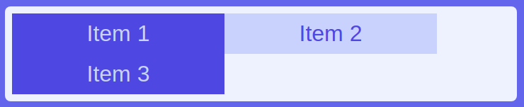

# Exercise G

Difficulty: ⭐

In this exercise you'll learn about making flex children wrap to the next row with the `flex-wrap` property, rather than overflow outside the flexbox.

Result:

Wide window:

Narrow window:

